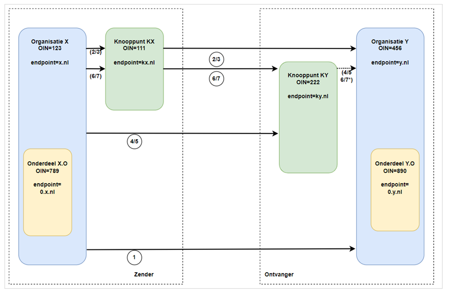

Handreiking Adressering en Routering

Doel van de Handreiking
=======================

De handreiking heeft tot doel organisaties een hulpmiddel te bieden hoe om te gaan met adresseren en routeren en het gebruik van het OIN hierbij.

Welke vragen worden beantwoord
==============================

Deze handreiking beschrijft wat we verstaan onder adresseren en routeren en op welke manier het OIN hierbij een rol speelt. Verder beschrijven we in detail hoe OIN's en subOIN's gebruikt kunnen worden in een berichtenketen.

Naast de identificatie van organisaties die niet in aangesloten registers staan, bieden subOIns ook de mogelijkheid van routeren van berichten door gebruik te maken van fijnmazige identificatie.

De volgende vragen komen aan de orde:

1. Het OIN wordt zowel gebruik voor authenticatie als voor adressering.

- Hoe werkt dit precies?

- Op welke plek wordt het OIN gebruikt?

- Kunnen er verschillende OIN's gebruikt worden?

2. Wanneer is het aan te raden om subOIns te gebruiken voor adresseren en routeren?

3. Hoe werkt routeren en adresseren? 

- Wat zijn de regels die partijen met elkaar moeten afspreken over het routeren en adresseren van berichten?

- Wat is de rol van certificaten bij routeren en adresseren

Welke onderdelen worden besproken
=================================

- Berichtenverkeer (bevragingen en meldingen)

- Cloud / SAAS partijen

Omgeving waar de handreiking voor geldt
=======================================

*Routeren* van berichten is nodig als een ontvanger van een bericht meerdere endpoints of knooppunten kent. De ontvanger bezit een of meerdere knooppunten waarop berichten voor de organisatie -en zijn onderdelen- binnenkomen. Op basis van attributen op de envelop-- en eventueel- de inhoud- van het bericht routeert het knooppunt het bericht naar het juiste endpoint. Een knooppunt kan ook op basis van de kenmerken van de *zender* een bericht routeren naar het juiste endpoint. In beide gevallen maakt de ontvanger gebruik van een routeringstabel

Organisaties die meerdere berichten-endpoints hebben, kunnen er voor kiezen om een subOIN aan te maken, om deze endpoints uniek te kunnen identificeren. De zender moet dit subOIN dan gebruiken in het bericht dat wordt verstuurd naar de ontvanger. Een zender kan zelf ook gebruik maken van subOIn's bijvoorbeeld om een organisatieonderdeel of een door haar beheerde voorziening te identificeren.

Als ontvanger of  zender geen gebruik willen maken van subOIN's moet de *afzender* en/of het *adres* van het endpoint uit andere kenmerken van het bericht worden afgeleid. 

Beschrijving van de werking
===========================

## 1. Het OIN wordt zowel gebruik voor authenticatie als voor adressering.

- *Hoe werkt dit precies?*

Voor de authenticatie van de zender en de ontvanger in het berichtenverkeer tussen overheidspartijen worden PKIo certificaten gebruikt. Het PKIo certificaat wordt zowel gebruikt om het transport van de berichten veilig te laten verlopen (gebruikmakend van het TLS protocol) als voor authenticatie. Bij het gebruik van Digikoppeling wordt tweezijdige authenticatie vereist. Zender en ontvanger moeten elkaars certificaat vertrouwen en elkaars publieke TLS sleutel kennen.

Naast het OIN is ook het endpoint van belang. Het endpoint is de URL van de service de  benaderd wordt. In Digikoppeling ebMS wordt het endpoint in het CPA vastgelegd. In WUS is dit onderdeel van het WS-addressing deel in de SOAP header. Voor asynchroon verkeer (ebMS) moet ook de endpoint van de zender bekend zijn. Voor REST API aanroepen wordt het endpoint in de URL van de http-actie aangegeven.

Adresseren en Routeren vindt plaats op het niveau van de berichtheader (en eventueel berichtbody) .  Voor het routeren kan gebruik gemaakt worden van het OIN, het opgegeven endpointadres of beide. 

- *Op welke plek wordt het OIN gebruikt?*

Een PKIo Certificaat dat gebruikt wordt voor berichtenuitwisseling met Digikoppeling bevat het OIN van de organisatie of organisatieonderdeel. Dit OIN wordt opgeslagen in het Subject.SerialNumber veld van het certificaat.

De Digikoppeling standaard beschrijft per Profiel -ebMS of WUS- , REST API welke manier het OIN gebruikt moet worden

1. ebMS: OIN van zender en ontvanger worden vastgelegd als PartyId in het  CPA (berichtencontract). De ebMS berichtenheader wordt gegenereerd op basis van de CPA.

2. WUS: in de querystring van de endpointuri in de SOAP ws-addressing header

3. REST API: in de querystring van de http operatie (of in het bericht)

- *Kunnen er in certificaat en header verschillende OIN's gebruikt worden?*

In het meest eenvoudige geval wisselen organisaties onderling berichten uit zonder tussenkomst van intermediairs of knooppunten. In dat geval is het OIN in het certificaat identiek als het OIN gebruikt in de berichtenheader

Indien gebruik wordt gemaakt van knooppunten (of SAAS)  zijn er meerdere varianten mogelijk. Het berichtenverkeer van een organisatie die een SAAS oplossing gebruikt kan gebruikmaken van het certificaat van die SAAS provider of bij de SAAS provider een eigen certificaat deponeren, zodat de SAAS provider het juiste certificaat  selecteert als een bericht namens de zender wordt gestuurd.

Een vergelijkbare situatie treedt op als een bericht naar een knooppunt wordt verstuurd, die het ontvangen bericht doorrouteert naar de uiteindelijke bestemming.

Het OIN dat wordt gebruikt in de berichtenheader kan afwijken van het OIN in het certificaat. In het geval dat een bericht wordt gestuurd naar een knooppunt dat het bericht verder doorstuurt binnen de eigen of een andere organisatie kan dit OIN uit de berichtenheader wordt gebruikt door het knooppunt als middel om het bericht te routeren. Naast routeren op basis van het OIN wordt ook gebruik gemaakt worden van endpoint adres.

**Routeringstabel**

In veel gevallen wordt door het knooppunt een routeringstabel (of  mappingtabel) gebruikt. In de tabel wordt beschreven naar welk endpoint adres een bericht wordt verstuurd op basis van het TO adres dat in het bericht is vermeld

## 2. Wanneer is het aan te raden om subOINs te gebruiken voor adresseren en routeren?

Over het gebruik van subOIN's voor adresseren en routeren bestaan verschillende opvattingen. Sommige organisaties kennen verschillende digitale postbussen van organisatieonderdelen of voorzieningen en gebruiken subOINS om deze digitale postbussen te identificeren. Andere organisaties willen het gebruik van OIN reserveren om Organisaties te identificeren en gebruiken voor het routeren van berichten binnen de organisatie ander kenmerken van het bericht. Het OIN stelsel maakt het eenvoudiger om subOIns aan te maken maar legt de partijen geen verplicht patroon op hoe subOIN's  gebruikt kunnen worden ten behoeve van adresseren en routeren. Partijen die met elkaar berichten uitwisselen zullen over het gebruik van subOIns onderling afspraken moeten maken.

## 3. Wat zijn de regels die partijen met elkaar moeten afspreken over het routeren en adresseren van berichten?

In deze handreiking zijn hieronder een aantal scenario's uitgewerkt: (zie ook bijlage 1).

|     |                                             | (Sub)OIN  | (Sub)OIN    | (Sub)OIN    | (Sub)OIN  |
| --- | ------------------------------------------- | --------- | ----------- | ----------- | --------- |
| Nr  | Type                                        | Verzender | Knooppunt A | Knooppunt B | Ontvanger |
|||| \*1 | \*2                                         |
| 1   | Direct                                      | 123       |             |             | 456       |
| 2   | Via alleen A (eigen OIN A)                  | 123       | 111         | nvt         | 456       |
| 3   | Via alleen A (A gebruikt OIN verzender)     | 123       | 123         | nvt         | 456       |
| 4   | Via alleen B (eigen OIN B)                  | 123       | nvt         | 222         | 456       |
| 5   | Via alleen B (B gebruikt OIN ontvanger)     | 123       | nvt         | 456         | 456       |
| 6   | Via A-B (eigen OIN A,B)                     | 123       | 111         | 222         | 456       |
| 7   | Via A-B (gebruikt OIN verzender, ontvanger) | 123       | 123         | 456         | 456       |

*1 Knooppunt A verzendt 'namens' verzender

*2 Knooppunt B ontvangt 'namens' ontvanger

*1 Direct*

In deze situatie gebruikt de verzender het eigen (Sub)OIN als afzender en het (Sub)OIN van de ontvanger als bestemming. Identificatie en Authenticatie geschiedt op basis van de beide TLS certificaten. Signing en encryptie kan gebruikt worden voor end-to-end beveilging

*2 Via Knooppunt A (waarbij eigen OIN van A gebruikt wordt voor TLS verbindingen met verzender en ontvanger)*

In deze situatie verloopt de communicatie via een knooppunt A.

Wanneer A een SAAS partij is is een aandachtspunt bij de communicatie van verzender naar de SAAS partij de beveiliging van dit traject (wanneer dit niet via Digikoppeling loopt).

Bij de communicatie van SAAS partij naar ontvanger zijn de afspraken rond machtiging relevant. In deze situatie gebruikt de SAAS partij het eigen OIN in het TLS certificaat, De ontvanger zal dit moeten accepteren en de oorspronkelijke verzender afleiden uit de afspraken, de bericht header of inhoud of op basis van end-to-end signing met een signing certificaat van de verzender.

*3 Via Knooppunt A (waarbij A (Sub)OIN van verzender gebruikt voor TLS verbindingen met ontvanger)*

In deze situatie wordt een knooppunt (bv SAAS partij) gemachtigd om namens verzender te communiceren door het verstrekken van een certificaat van de verzender aan deze partij. De verzender kan dit certificaat intrekken wanneer het knooppunt niet langer is toegestaan om dit te gebruiken. Aandachtspunt is het certificaat dmv subOIN fijnmazig te definiëren om misbruik uit te sluiten.

*4 Via Knooppunt B (waarbij B eigen OIN van B gebruikt voor TLS verbindingen met verzender)*

In deze situatie is B gemachtigd om berichten te ontvangen en door te geven aan ontvanger;

Hierbij gelden vergelijkbare aandachtspunten als bij punt 2;

*5 Via Knooppunt B (waarbij B (Sub)OIN van ontvanger gebruikt voor TLS verbindingen met verzender )*

In deze situatie wordt een knooppunt (bv SAAS partij) gemachtigd om namens ontvanger te communiceren door het verstrekken van een certificaat van de ontvanger aan deze partij.

Hierbij gelden vergelijkbare aandachtspunten als bij punt 3;

*6 Via Knooppunt A en B (met gebruik van eigen OIN A,B voor TLS verbindingen)*

A en B maken verbinding via het eigen TLS certificaat. Aandachtspunt is daarom het machtigen van deze partijen om te acteren in de keten. Routering kan op basis van afspraken, de bericht header of bericht inhoud of op basis van end-to-end signing met een signing certificaat van de verzender/ontvanger. Specifiek is dat ook Knooppunt A en B elkaar moeten 'vertrouwen' in de communicatie.

*7 Via Knooppunt A en B (met gebruik van OIN verzender, ontvanger voor TLS verbindingen)*

In deze situatie worden knooppunten (bv SAAS partijen) gemachtigd om namens ontvanger te communiceren door het verstrekken van een certificaat van de ontvanger aan deze partij. Hierbij gelden vergelijkbare aandachtspunten als bij punt 3;

Bijlage 1. Voorbeelden van de werking
=====================================

In deze handreiking hebben we een aantal scenario's uitgewerkt. De scenario's zijn hier in detail uitgewerkt.

1. Partijen maken beide gebruik van subOINS voor het identificeren van organisatie onderdelen

2. Een van de partijen in de keten maakt geen gebruik van subOIn's

3. Een van de partijen in de keten maakt geen gebruik van subOIn's

## Situatie 1: zowel zender als ontvanger maken gebruik van subOIN's

| 1           | Zendende Partij                 | Ontvangende  Partij              | Via         | OIN in Certificaat Zender (tbv TLS) | OIN in Certificaat Ontvanger (tbv TLS) | OIN in HEADER FROM| OIN in HEADER TO    | Endpoint Zender | Endpoint Ontvanger|
| ----------- | ------------------------- | ------------------------- | ----------- | ------------------------- | ------ | ------ | --------- | -------- | -------- |
| 1 | Organisatie X             | Organisatie Y             |                            | 123                | 567                 | 123 | 567        | x.nl    | y.nl          |
| 2 | Organisatie Onderdeel X.O | Organisatie Y             |                            | 123 of 789         | 567                 | 789 | 567        | o.x.nl  | y.nl          |
| 3 | Organisatie X             | Organisatie Onderdeel Y.O |                            | 123                | 567 of 890          | 123 | 890        | x.nl    | o.y.nl        |
| 4 | Organisatie X             | Organisatie Y             | Knooppunt Y                | 123                | 567 of 345          | 123 | 567 of 345 | x.nl    | y.nl of ky.nl |
| 5 | Organisatie X             | Organisatie Y             | Knooppunt X                | 123 of 234         | 567                 | 123 | 567        | kx.nl   | y.nl          |
| 6 | Organisatie X             | Organisatie Y             | Knooppunt X en Knooppunt Y | 12of 2343          | 567 of 345          | 123 | 567        | kx.nl   | ky.nl         |
| 7 | Organisatie Onderdeel X.O | Organisatie Y             | Knooppunt X en Knooppunt Y | 123 of 789 of 234  | 567 of 345          | 789 | 567        | o.kx.nl | ky.nl         |
| 8 | Organisatie Onderdeel X.O | Organisatie Onderdeel Y.O | Knooppunt X en Knooppunt Y | 123 of 789, of 234 | 567, of 345, of 890 | 789 | 890        | o.kx.nl | o.y.nl        |
| 9 | Organisatie Onderdeel X.O | Organisatie Onderdeel Y.O |                            | 123 of 789         | 567, of 890         | 789 | 890        | o.x.nl  | o.y.nl        |

## **Situatie 2: Zender maakt géén gebruik van subOIN's, Ontvanger maakt gebruik van subOIN's**

In bovenstaande plaat zijn twee onderdelen van Organisatie X (X.O1 en X.O2) opgenomen. Om de tekening niet te ingewikkeld te maken zijn de lijntjes van de koppelingen niet dubbel getekend. Als voorbeeld: Lijn 2 loopt van Organisatie Onderdeel  XO**1** naar Organisatie Y, Lijn 2" loopt van Organisatie Onderdeel  XO**2** naar Organisatie Y.

|

#

 |

Zendende

Partij

 |

Ontvangende

Partij

 |

Via

 |

OIN in Certificaat Zender

 |

OIN in

Certificaat

Ontvanger

 |

OIN in

Header

FROM*

 |

OIN in

Header

TO*

 |

Endpoint\
Zender*

 |

Endpoint\
Ontvanger

 |
|

2

 |

Onderdeel X.O1

 |

Organisatie Y

 |  |

123

 |

567

 |

123

 |

567

 |

x.nl of

o1.x.nl

 |

y.nl

 |
|

2"

 |

Onderdeel X.O2

 |

Organisatie Y

 |  |

123

 |

567

 |

123

 |

567

 |

x.nl of

o2.x.nl

 |

y.nl

 |
|

7

 |

Onderdeel X.O1

 |

Organisatie Y

 |

Knooppunt KY

 |

123

 |

567

of 345

 |

123

 |

567

 |

x.nl of

o1.x.nl

 |

ky.nl

 |
|

7"

 |

Onderdeel X.O2

 |

Organisatie Y

 |

Knooppunt KY

 |

123

 |

567 of 345

 |

123

 |

567

 |

x.nl of

o2.x.nl

 |

ky.nl

 |
|

8

 |

Onderdeel X.O1

 |

Onderdeel Y.O

 |

Knooppunt KY

 |

123

 |

567

of 345

of 890

 |

123

 |

890

 |

x.nl of

o1.x.nl

 |

o.y.nl

 |
|

8"

 |

Onderdeel X.O2

 |

Onderdeel Y.O

 |

Knooppunt KY

 |

123

 |

567

of 345

of 890

 |

123

 |

890

 |

x.nl of

o2.x.nl

 |

o.y.nl

 |
|

9

 |

Onderdeel X.O1

 |

Onderdeel Y.O

 |  |

123

 |

567

 |

123

 |

890

 |

x.nl of

o1.x.nl

 |

o.y.nl

 |
|

9"

 |

Onderdeel X.O2

 |

Onderdeel Y.O

 |  |

123

 |

567

 |

123

 |

890

 |

o2.x.nl

 |

o.y.nl

 |

 * velden zijn alleen verplicht voor asynchroon verkeer(ebMS)

**Situatie 3: Zender maakt gebruik van subOINs,  ontvanger maakt géén  gebruik van subOIN's**

In bovenstaande plaat zijn twee onderdelen van Organisatie Y (Y.O1 en Y.O2) opgenomen. Om de tekening niet te ingewikkeld te maken zijn de lijntjes van de koppelingen niet dubbel getekend. Als voorbeeld: Lijn 3 loopt van Organisatie X naar Organisatie Onderdeel Y.O**1**, Lijn 3" loopt van Organisatie X naar Organisatie Onderdeel Y.O**2**.

|

#

 |

Zendende

Partij

 |

Ontvangende

Partij

 |

Via

 |

OIN in Certificaat Zender

 |

OIN in

Certificaat

Ontvanger

 |

OIN in

Header

FROM*

 |

OIN in

Header

TO*

 |

Endpoint\
Zender*

 |

Endpoint\
Ontvanger

 |
|

3

 |

Organisatie X

 |

Onderdeel Y.O1

 |  |

123

 |

567

 |

123

 |

567

 |

x.nl

 |

y.nl of

o1.y.nl

 |
|

3"

 |

Organisatie X

 |

Onderdeel Y.O2

 |  |

123

 |

567

 |

123

 |

567

 |

x.nl

 |

y.nl of

o2.y.nl

 |
|

8

 |

Onderdeel X.O

 |

Onderdeel Y.O1

 |

Knooppunt KX

 |

123 of

234 of

789

 |

567

 |

789

 |

567

 |

k.x.nl

 |

y.nl of o1.y.nl

 |
|

8

 |

Onderdeel X.O

 |

Onderdeel Y.O2

 |

Knooppunt KX

 |

123 of

234 of

789

 |

567

 |

789

 |

567

 |

k.x.nl

 |

y.nl of o2.y.nl

 |
|

9

 |

Onderdeel X.O

 |

Onderdeel Y.O1

 |  |

123 of 789

 |

567

 |

789

 |

567

 |

o.x.nl

 |

y.nl of o1.y.nl

 |
|

9

 |

Onderdeel X.O

 |

Onderdeel Y.O2

 |  |

123 of 789

 |

567

 |

789

 |

567

 |

o.x.nl

 |

y.nl of o2.y.nl

 |
|

10

 |

Organisatie X

 |

Onderdeel Y.O1

 |

Knooppunt KX

 |

123 of 234

 |

567

 |

123

 |

567

 |

k.x.nl

 |

y.nl of

o1.y.nl

 |
|

10"

 |

Organisatie X

 |

Onderdeel Y.O2

 |

Knooppunt KX

 |

123 of 234

 |

567

 |

123

 |

567

 |

k.x.nl

 |

y.nl of

o2.y.nl

 |

* velden zijn alleen verplicht voor asynchroon verkeer(ebMS)

**BIJLAGE Digipoort**

**Digipoort -- Routeermechanisme (vereenvoudigd)**

**Routeertabel**

|

naam

 |

identiteit

 |

berichtsoort

 |

intermediair

 |

endpoint ontvanger

 |
|

Overheidspartij A

 |

OIN:123

 |

factuur

 |  |

oA.nl

 |
|

Overheidspartij B

 |

OIN:456

 |

factuur

 |

OIN: 222

 |  |
|

Intermediair A

 |

OIN:222

 |

factuur

 |  |

ia.nl

 |
|

Accountant

 |

KvK:333

 |

order

 |  |

x@ac.nl

 |
|

Bedrijf A

 |

BTW:123

 |

order

 |

KvK:333

 |  |
|

Bedrijf B

 |

KvK:444

 |

order

 |

KvK:333

 |  |
|

Bedrijf C

 |

KvK:777

 |

order

 |  |

bC.nl

 |

**OIN matrix (al het verkeer loopt over Digipoort)**

|

#

 |

Zendende

Partij

 |

Ontvan-gende

Partij

 |

Bericht\
type

 |

ID in PKIo Zender è Digipoort

 |

ID  in PKIo  Ontvanger ç Digipoort

 |

ID Belang-hebbende (bericht)

 |

ID  Ont-vanger (bericht)

 |

Endpoint\
Zender

 |

Endpoint\
Ontvanger

 |
|

1

 |

OIN:123

 |

BTW:123

 |

order

 |

OIN:123

 |

KvK:333

 |

OIN:123

 |

BTW:123

 |

oA.nl

 |

x@ac.nl

 |
|

2

 |

BTW:123

 |

OIN:123

 |

factuur

 |

KvK:333

 |

OIN:123

 |

BTW:123

 |

OIN:123

 |

x@ac.nl

 |

oA.nl

 |
|

3

 |

OIN:456

 |

KvK:444

 |

order

 |

OIN:456

 |

KVK:333

 |

OIN:123

 |

KvK:444

 |

oB.nl

 |

x@ac.nl

 |
|

4

 |

KvK:444

 |

OIN:456

 |

factuur

 |

KvK:333

 |

OIN:222

 |

KvK:444

 |

OIN:456

 |

x@ac.nl

 |

ia.nl

 |
|

5

 |

OIN:123

 |

KvK:777

 |

order

 |

OIN:123

 |

KvK:777

 |

OIN:123

 |

KvK:777

 |

oA.nl

 |

bC.nl

 |
|

6

 |

KvK:777

 |

OIN:123

 |

factuur

 |

KvK:777

 |

OIN:123

 |

KvK:777

 |

OIN:123

 |

bC.nl

 |

oA.nl

 |

Aandachtspunten:

- Het OIN in een certificaat is niet relevant voor TLS. Alleen de trustconfiguratie speelt een rol

- Een Organisatie Onderdeel is een uniek te identificeren systeem binnen de organisatie

- 4 nader uitwerken transparant en niet transparante intermediair

BIJLAGE Intermediairs

Definitie: Een partij in de keten die berichten doorstuurt naar de volgende schakel in de keten.

|

**Transparant**

 |

**Niet Transparant**

 |
|

**Definitie**: Een partij in de keten die berichten onbewerkt doorstuurt naar de volgende schakel in de keten.

 |

**Definitie**: Een partij in de keten die berichten doorstuurt en mogelijk iets aan het bericht (of de berichtheader) te wijzigt.

 |
|

Endpoint van het transport in een Digikoppeling keten. De TI is een andere partij dan de party in de conversation

 |

Endpoint in een Digikoppeling keten. De NTI is partij in de party in de conversation

 |
|

Requestor kent endpoint van provider (De TI is de provider van het eerste endpoint - in Duo termen de logistieke dienstverlener -- doet ook TLS offloading)

 |

Requestor hoeft endpoint van provider niet te kennen

 |
|

Bericht wordt onbewerkt doorgezonden naar endpoint. Alleen Header wordt gelezen. Signatures blijven ongewijzigd. De payload kan encrypted zijn en onleesbaar voor de TI blijven.

 |

Bericht (zowel header als payload) kan bewerkt worden en wordt dan doorgezonden naar nieuw endpoint. Signature van requestor wordt verbroken. Het is mogelijk een bericht te encrypten en door te laten sturen zonder dat de NTI inzage heeft.

 |
|

Geen bewerkersovereenkomst

 |

Bewerkerovereenkomst nodig

 |
|

Geen tussentijdse opslag

 |

Store-and-Forward mogelijk

 |
|

CPA/WSDL tussen requestor en provider >> nagaan bij JUSTID -- mogelijk wel voor WSDL en niet voor CPA

 |

CPA/WSDL tussen requestor-intermediair **en** intermediair-provider

 |
|  |

Afnemers stellen  eisen aan intermediairs (Cloud Security Alliance)). Afnemers houden registers bij van intermediairs

 |
|

Voorbeelden: Jubes

 |

Voorbeelden: SAAS leveranciers, Sectorale knooppunt,

Voorbeelden uit de praktijk: Rinis, Digipoort

 |
|

De TI is geen partij in de conversatie (niet in From of To)

 |

De NTI is een partij in de conversatie (From of To)

 |
|

De TI doet aan Service Virtualisatie en identity virtualisatie

 |

De NTI doet mogelijk aan Service Virtualisatie. Niet aan identity virtualisatie.

De NTI kan mogelijk ook een uitgebreidere of vereenvoudigde service aanbieden.

 |
|

De TI is een endpoint (technische bestemming) maar geen eindstation (Functionele bestemming)

 |  |
|

Wel een partij in het technische contract, niet in het business contract

 |

Zowel een partij in het technische contract, als in het business contract

 |
|  |  |
